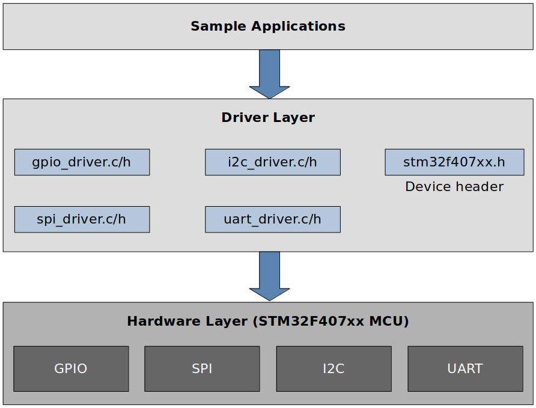

# MCU Peripheral Drivers

## Introduction

* Developed MCU peripheral (GPIO, I2C, SPI, USART) drivers from scratch on the STM32F407-Discovery board
* Developed applications to test correct functionalities of each peripheral driver

## Development Environment

* Operating system: Ubuntu 22.04 LTS
* Integrated Development Environment (IDE): STM32 CubeIDE Version 1.10.1

## Architecture

## List of Files

* Peripheral drivers
  * Device header: [stm32f407xx.h](./workspace/stm32fxx_drivers/Drivers/Inc/stm32f407xx.h)
  * GPIO driver: [stm32f407xx_gpio.h](./workspace/stm32fxx_drivers/Drivers/Inc/stm32f407xx_gpio_driver.h),  [stm32f407xx_gpio.c](./workspace/stm32fxx_drivers/Drivers/Src/stm32f407xx_gpio_driver.c)
  * SPI driver: [stm32f407xx_spi.h](./workspace/stm32fxx_drivers/Drivers/Inc/stm32f407xx_spi_driver.h),  [stm32f407xx_spi.c](./workspace/stm32fxx_drivers/Drivers/Src/stm32f407xx_spi_driver.c)
  * I2C driver: [stm32f407xx_i2c.h](./workspace/stm32fxx_drivers/Drivers/Inc/stm32f407xx_i2c_driver.h),  [stm32f407xx_i2c.c](./workspace/stm32fxx_drivers/Drivers/Src/stm32f407xx_i2c_driver.c)
  * USART driver: [stm32f407xx_usart.h](./workspace/stm32fxx_drivers/Drivers/Inc/stm32f407xx_usart_driver.h),  [stm32f407xx_usart.c](./workspace/stm32fxx_drivers/Drivers/Src/stm32f407xx_usart_driver.c)

* Sample applications (Test drivers)
  * See [./workspace/stm32fxx_drivers/Src](./workspace/stm32fxx_drivers/Src)
