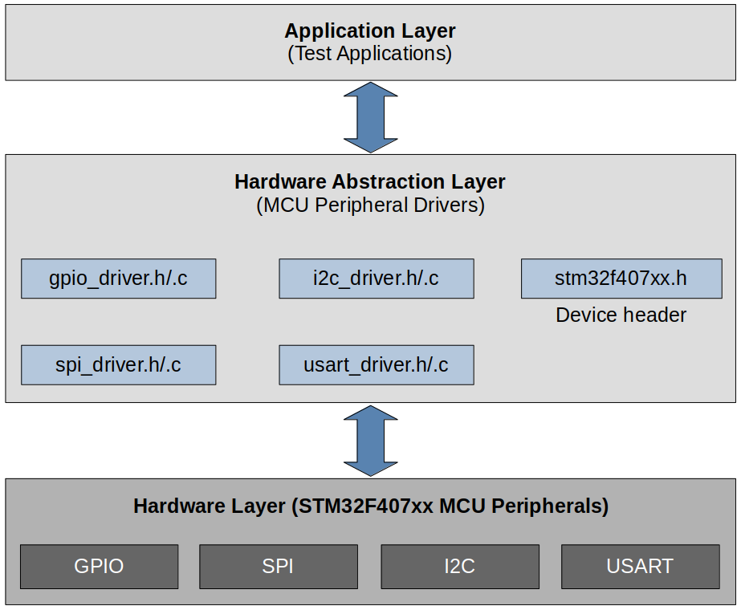
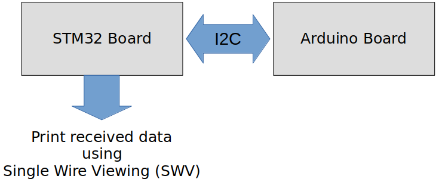
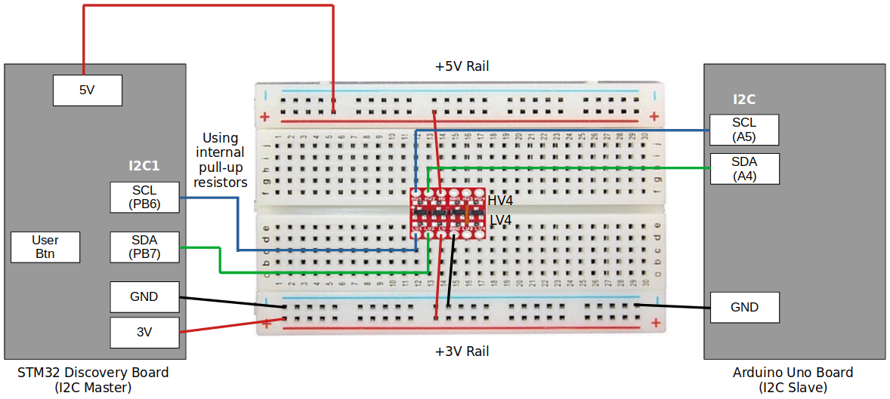
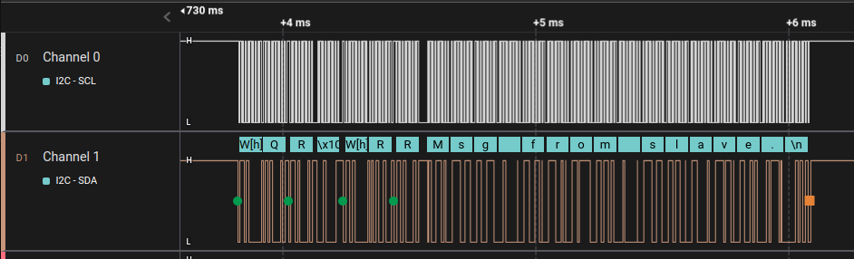
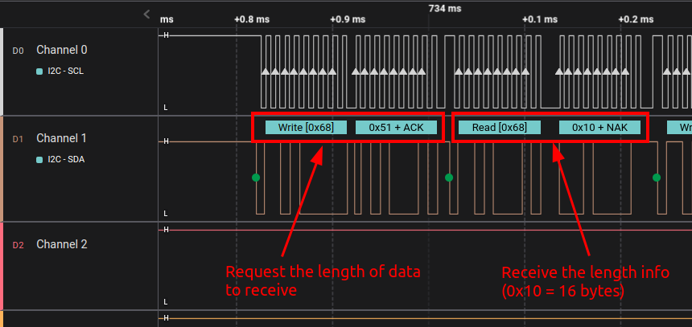
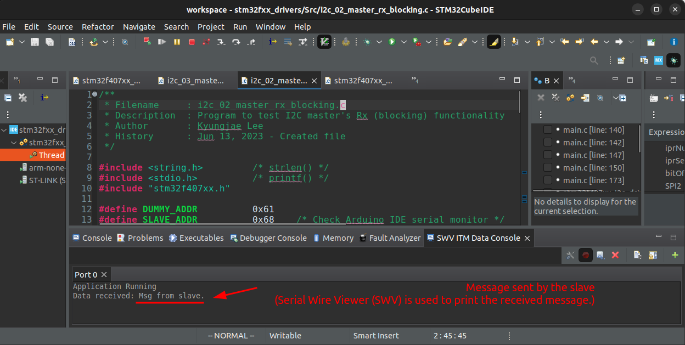

# MCU Peripheral Drivers

This repository contains the source code for the **MCU Peripheral Drivers** development project. Visit the "MCU Peripheral Drivers" section on my website for more details: [https://kyungjae.dev/mcu-peripheral-drivers/](https://kyungjae.dev/mcu-peripheral-drivers/).

## Introduction

* Developed MCU peripheral (GPIO, I2C, SPI, USART) drivers from scratch on the STM32F407G-Discovery board
* Developed applications to test correct functionalities of each peripheral driver
* Please see the [LCD Digital Clock](./lcd-digital-clock) project to observe how these drivers are utilized in a real-world embedded systems project

## Development Environment

* Operating system: Ubuntu 22.04 LTS
* Integrated Development Environment (IDE): STM32 CubeIDE Version 1.10.1

## Architecture

### Software Layers

* **Application layer** consists of test applications designed to verify the proper functionality of the GPIO, SPI, I2C, and  USART peripheral drivers for the STM32F407xx MCU.
* **Hardware abstraction layer** includes the device-specific header file for STM32F407xx MCU, along with the GPIO, SPI,  I2C, and USART peripheral drivers. This layer provides the application layer with a range of APIs to control the respective MCU peripherals.

## List of Files

* Driver layer (Peripheral drivers)
  * Device header: [stm32f407xx.h](./workspace/stm32fxx_drivers/Drivers/Inc/stm32f407xx.h)
  * GPIO driver: [stm32f407xx_gpio_driver.h](./workspace/stm32fxx_drivers/Drivers/Inc/stm32f407xx_gpio_driver.h),  [stm32f407xx_gpio_driver.c](./workspace/stm32fxx_drivers/Drivers/Src/stm32f407xx_gpio_driver.c)
  * SPI driver: [stm32f407xx_spi_driver.h](./workspace/stm32fxx_drivers/Drivers/Inc/stm32f407xx_spi_driver.h),  [stm32f407xx_spi_driver.c](./workspace/stm32fxx_drivers/Drivers/Src/stm32f407xx_spi_driver.c)
  * I2C driver: [stm32f407xx_i2c_driver.h](./workspace/stm32fxx_drivers/Drivers/Inc/stm32f407xx_i2c_driver.h),  [stm32f407xx_i2c_driver.c](./workspace/stm32fxx_drivers/Drivers/Src/stm32f407xx_i2c_driver.c)
  * USART driver: [stm32f407xx_usart_driver.h](./workspace/stm32fxx_drivers/Drivers/Inc/stm32f407xx_usart_driver.h),  [stm32f407xx_usart_driver.c](./workspace/stm32fxx_drivers/Drivers/Src/stm32f407xx_usart_driver.c)

* Application layer (Test applications)
  * See [./workspace/stm32fxx_drivers/Src](./workspace/stm32fxx_drivers/Src)

## Testing (I2C Example)

* The following example is taken from one of the I2C peripheral driver tests. For additional tests on various other MCU peripheral drivers, please visit the [MCU Peripheral Drivers](https://kyungjae.dev/mcu-peripheral-drivers/) section on my notebook.

### Communication Interfaces

### Wiring

### Analysis using the Logic Analyzer

### Cross-checking using the STM32CubeIDE Data Console

