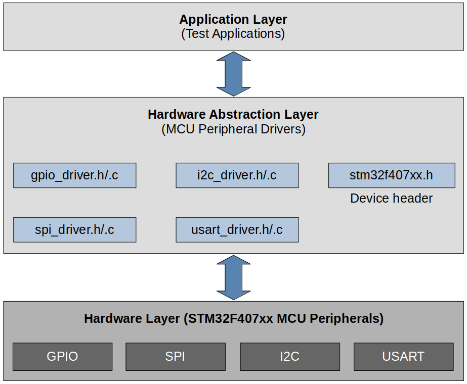
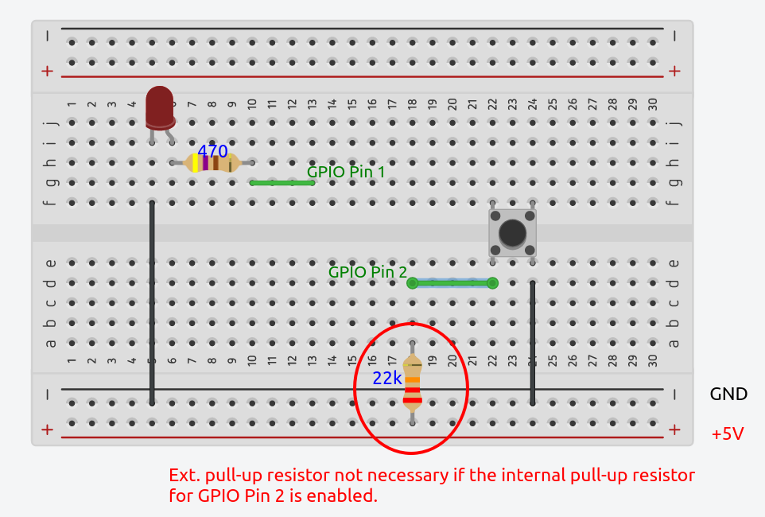
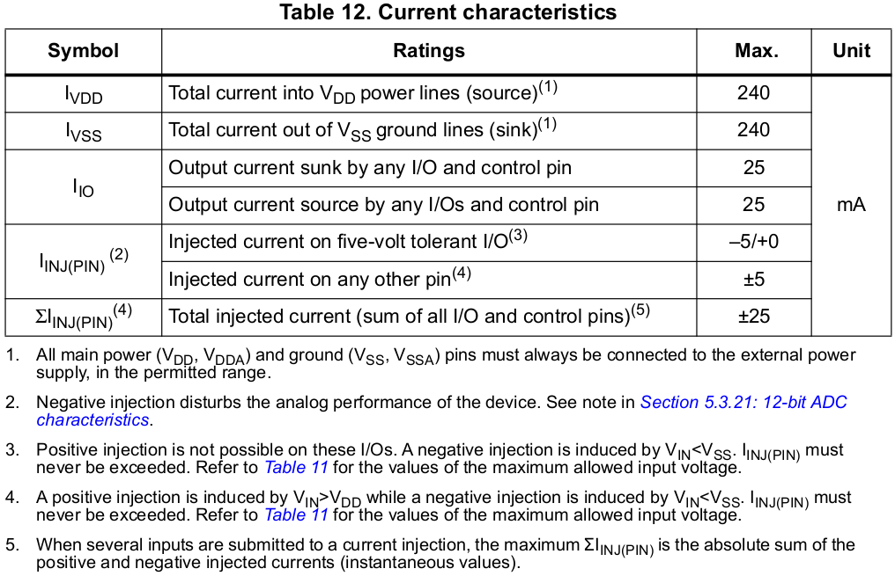

# Lessons Learned


## STMCubeIDE Features

* Data Watch Point
  * Helpful for keeping track of where the selected variable gets updated
* Special Function Registers (SFRs) window (Window $\to$ Show View $\to$ SFRs)
  * Helpful for inspecting or controlling the content of the microcontroller's peripheral registers (e.g., GPIO registers, ADC registers, etc.)
* Code auto completion: `ctrl` + `space`
* View list of functions & global variables: `ctrl` + `o`
  * Quickly find the function and jump to it
* Adding the custom header file folder to the compiler include path: Project $\to$ Properties $\to$ C/C++ Build $\to$ Settings $\to$ MCU GCC Compiler $\to$ Include paths


## Memory Map of the MCU (STM32F4xx)

* Uses ARM Cortex-M4 processor

* Width of the system bus: 32 bits

  * The processor can product 2^32^ different addresses (4 GB).
  * 0x0000_0000 ~ 0xFFFF_FFFF

* Each MCU peripheral is mapped to a subset of these addressable memory addresses.

  * e.g., When the processor produces 0x4002_0000 on the system bus, it is referring to the GPIO registers.

* Different types of MCUs have different memory maps but the fundamentals are the same. Consult the MCU reference manual for the MCU specific information.

* See also, [https://kyungjae.dev/embedded-systems-programming-arm/memory-map](https://kyungjae.dev/embedded-systems-programming-arm/memory-map).

* Some important base addresses of peripheral registers:

  ```c
  /* Base adddress of AHB1 peripheral registers */
  #define AHB1_BASE	0x40020000U
  
  /* Base adddress of GPIOA peripheral registers */
  #define GPIOA_BASE	0x40020000U
  
  /* Base adddress of RCC engine registers of the MCU */
  #define RCC_BASE	0x40023800U
  
  /* Base adddress of APB1 peripheral registers */
  #define APB1_BASE	0x40000000U
  
  /* Base adddress of FLASH memory */
  #define FLASH_BASE	0x40020000U
  
  /* Base adddress of SRAM1, SRAM2 */
  #define SRAM1_BASE	0x20000000U
  #define SRAM1_SIZE	(112 * 1024)	/* SRAM1: 112 KB, SRAM2: 16 KB */
  #define SRAM2_BASE	((SRAM1_BASE) + (SRAM1_SIZE))
  
  /* Base adddress of ADC1 peripheral registers */
  #define ADC1_BASE	0x40012000U
  ```

  > Make sure to find this information from the MCU reference manual.

  

## MCU Bus Interfaces

* The Cortex-M4 processor contains 3 external Advanced High-performance Bus (AHB)-Lite bus interfaces: **I-Code**, D-Code, **S bus** interfaces.

  * If the instruction is present in between the memory locations 0x00000000 - 0x1FFFFFFF then the processor will fetch the instruction using I-Code interface.
  * If the instruction is present outside 0x00000000 - 0x1FFFFFFF range then the processor will fetch the instruction over the system bus.
  * If the data is present in between the memory locations 0x00000000 - 0x1FFFFFFF then the processor will fetch the data using D-Code interface.
  * If the data is present outside 0x00000000 - 0x1FFFFFFF range then the processor will fetch the data over the system bus.

  The base address of the Flash memory for STM32F407xx microcontroller is 0x08000000. Therefore, we know that the constant data will be fetched over the D-Code bus interface.

  Many MCU peripherals are located outside the range 0x00000000 - 0x1FFFFFFF and therefore uses system bus interface to communicate.

  [!] Note: Since these bus interfaces belongs to the processor, you need to reference the documentation of the processor (not microcontroller) to learn more about them.

* Data and Storage

  ```c
  #include <string.h>
  #include <stdint.h>
  
  /* String literal (constant data) - Will be stored in ROM (Flash memory) */
  const char *pMessage = "Hello world!";
  
  /* Constant data - Will be stored in ROM (Flash memory) */
  const int value = 100;
  
  /* Variable data - Will be stored in SRAM */
  char data[50];
  
  int main(int argc, char *argv[])
  {
      for (uint32_t i = 0; i < strlen(pMessage); i++)
      {
          /* Data copy from Flash to SRAM */
          data[i] = *(pMessage + i);
      }
      
      for (;;);
  }
  ```

  

## Analyzing MCU Block Diagram

Reference: STM32F407xx MCU

1. Is the system bus connected to Flash memory?

   $\to$ No (Only I-Code and D-Code are. This may not be apparent on the block diagram in the 'Functional overview' section, but is clearly described in the zoomed in diagram with more details.)

2. Can processor fetch instructions from SRAM over I-Code?

   $\to$ No in general. But there is a way to make it possible.

3. What's the maximum speed at which the system bus can operate?

   $\to$ 168 MHz (See the processor portion of the block diagram)

4. Are SRAMs connected to the system bus?

   $\to$ Yes (Connected to the system bus via AHB bus-matrix)

5. What's the maximum speed at which the APB1 can operate?

   $\to$ 42 MHz (See the block diagram)

6. Suppose I have a peripheral whose operating frequency or speed must be greater than 95 MHz, can I connect it via APB2 bus?

   $\to$ No (APB2 bus only supports up to 84 MHz)

7. Can processor fetch instructions and data simultaneously from SRAM?

   $\to$ No (There's only one bus connection between the processor and SRAM; the system bus.)

8. Can processor fetch instructions and data simultaneously from Flash?

   $\to$ Yes (Since there are two separate buses; I-Code, D-Code)

9. What's the maximum HCLK frequency?

   $\to$ 168 MHz (Denoted by the maximum frequency of AHB1 bus interface)

10. What's the maximum P1CLK frequency?

    $\to$ 42 MHz (Denoted by the maximum frequency of APB1 bus interface)

11. What's the maximum P2CLK frequency?

    $\to$ 84 MHz (Denoted by the maximum frequency of APB2 bus interface)

12. Do GPIOs and processor communicate over AHB1 bus?

    $\to$ Yes

13. Do USB OTG and processor communicate over AHB2 bus? 

    $\to$ Yes

14. Can OTG and GPIOs communicate with processor concurrently or simultaneously?

    $\to$ No (Those communications are serialized by the AHB bus-matrix. The AMBA bus specification is a multi-master bus standard. As a  result, a bus arbiter is required to ensure that only one bus master has access to the bus at any particular time.)

15. Can processor talk to Flash memory and SRAM simultaneously?

    $\to$ Yes (There are separate bus interfaces for them; I-Code, D-Code buses for Flash memory, system bus for SRAM)


## Bus Matrix

* The AMBA bus specification is a multi-master bus standard. As a  result, a bus arbiter is required to ensure that only one bus master has access to the bus at any particular time.
* The following diagram shows which master can communicate with which slaves via which bus.


## Clocks

* Clock sources:

  * **Crystal oscillator** (External to the MCU) - HSE

    External component that has to be connected to the MCU in order to supply the clock. You can choose to not use crystal oscillator depending on the project design.

    8 MHz - This information must be obtained from the board reference manual since the crystal oscillator is external to the MCU.

  * **RC oscillator** (Internal to the MCU) - HSI

    Resistance-Capacitance oscillator 

    STM32F407xx MCU contains RC oscillator inside it. No connection to the outside clock source is necessary. 

  * **Phase Locked Loop (PLL)** (Internal to the MCU)

    Implemented inside the MCU. Generates higher-frequency clock by using the lower-frequency clock input.

### HSE (High-speed External)

* In general, there are 2 ways to configure HSE clock source:
  * External clock - Using other external clock source (e.g., from other circuitry or MCU)
  * Crystal/ceramic resonators - Using on-board crystal/ceramic resonators is supported
    * Discovery board comes with an on-board crystal resonator which can be used as an HSE clock source. (Find "X2 crystal" in the schematic!)
    * Nucleo board does not come with an on-board crystal resonator so using an external clock source is the only way to configure HSE. HSE is of 8 MHz pulled from ST-LINK circuitry.

### HSI (High-speed Internal)

* The HSI clock signal is generated from an internal 16 MHz RC oscillator and can be used directly as a system clock, or used as PLL input.
* On reset, MCU uses HSI as its default clock source.
* By default, HSE and PLL are disabled. To use these clock sources you need to enable them and select one via the System Clock Mux.


## Clock Configuration

* STM32CubeIDE Clock Configuration GUI:

  Be able to understand the clock hierarchy from the following diagram. For example, `APB1 peripheral clocks` are derived from the `PCLK1` which is derived from the `HCLK` adjusted by the `APB1 Prescalar`. And the `HCLK` is derived from the `SYSCLK` whose source is currently set to PLL. (Here, by default, PLL source is selected as HSI. By manipulating the multiplier and divider, etc. you can modify the SYSCLK frequency.)

  To configure all these, reference the "RCC clock control register (RCC_CR)" section of the MCU reference manual.


## Peripheral Clock Configuration

* In modern MCUs, before using any peripheral, you must enable its peripheral clock using peripheral clock registers.
* By default, peripheral clocks of almost all peripherals will be disabled to save power.
* A peripheral won't take or respond to your configuration values until you enable its peripheral clock.
* In STM32 microcontrollers, peripheral clocks are managed through RCC registers.


## Alternate Function Mapping for MCU Pins

* You can multiplex different functionalities of MCU pins by configuring their modes (i.e., alternate function modes).


## Vector Table

* Table of vectors (Here, vectors mean "pointers" or "addresses")

  $=$ Table of pointers (or addresses) of exception handlers

* Exceptions include:

  * 15 system exceptions (internal to the processor)

  * 240 interrupts (external to the processor)
    * Out of 240 rooms provided for interrupts by default, STM32F407xx MCU supports only 82. 

* Vector table is implemented in the startup code of your project. (A startup file can be written either in C or assembly.)

* Total space consumed by the vector table:

  1 (initial stack pointer) + 97 (exceptions) = 98 words = 392 bytes


## MCU Interrupt Design

* Some peripherals (e.g., GPIO) deliver their interrupt to the NVIC over the EXTI line while others (e.g., SPI) deliver their interrupt directly to the NVIC. This is the MCU vendor specific design.

  See the "External interrupt/event controller (EXTI)" section of the MCU reference manual.

  

  

  

  > By default, interrupt requests through all 23 lines are masked. You need to unmask the line you want to enable using the Interrupt Mask Register (`EXTI_IMR`).
  >
  > The way the edge detect circuit detects interrupts can be configured by using the Rising Trigger Selection (`EXTI_RTSR`) Register and/or Falling Trigger Selection Register (`EXTI_FTSR`).

  

  

  

  > The pending register is necessary because in some cases, multiple EXTI lines have the same interrupt handler and having `EXTI_PR` helps figure out which EXTI line triggered the handler. (The pending bit is a status indicator that signals the occurrence of a  specific event or error. When the pending bit is set, it means that the  event or error has taken place and is waiting to be attended to by the  processor. Once the processor has addressed the event or error, the user can clear the pending bit. The user can only interact with the pending  bit and has no control over the pending state of the EXTI lines in any  other manner.)
  >
  > A pending bit (bits[22:0]) is set when the selected edge event arrives on the external interrupt line. A pending it is cleared by programming it to 1(?). $\to$ I know this is confusing but ST designed it this way. To check if this really works this way, use the debugger. 
  >
  > Even if the EXTI0 line is cleared, if the bit[0] of the EXTI Pending Register is not cleared, the processor will get an infinite interrupt request. Make sure to clear it once it is set.

* e.g., GPIO interrupts:

  * **0**th pins of all GPIO port deliver their interrupt to the NVIC over EXTI**0** line. Only one at any given time can be selected by the multiplexer and EXTI**0**[3:0] bits in the SYSCFG_EXTICR1 register decides it.
  * **1**th pins of all GPIO port deliver their interrupt to the NVIC over EXTI**1** line. Only one at any given time can be selected by the multiplexer and EXTI**1**[3:0] bits in the SYSCFG_EXTICR1 register decides it.
  * ...
  * **15**th pins of all GPIO port deliver their interrupt to the NVIC over EXTI**15** line. Only one at any given time can be selected by the multiplexer and EXTI**15**[3:0] bits in the SYSCFG_EXTICR4 register decides it.

  In the STM32F407-Discovery board, the user button is connected to the GPIO PA0 pin. That means, the interrupt triggered by the user button press will be delivered over the EXTI0 line and you need to implement the EXTI0 handler to service the interrupt.

* How to issue user button interrupt to the processor in STM32?

  1. The button is connected to a GPIO pin of the microcontroller.
  2. The GPIO pin should be configured to input mode.
  3. The link between a GPIO port and the corresponding EXTI line must be established using the SYSCFG_EXTICRx register.
  4. Configure the trigger detection (falling/rising/both) for relevant EXTI line. (This is done via EXTI controller regsters.)
  5. Implement the handler to service the interrupt.


## General Purpose Input/Output (GPIO)


* A GPIO pin can be used for many purposes as shown below. This is why it is called as "General purpose". (Some pins of an MCU cannot be usd for all these purposes. So, those are called as "Pins" but not as "GPIOs".)
* A GPIO pin of MCU can be operate in:
  * Input mode
    * Interrupt - When an MCU pin is in input mode, it can be configured to issue an interrupt to the processor.
  * Output mode
  * Alternate function mode
  * Analog mode

### Input Mode

* When an I/O pin is programmed as input mode:

  * The output buffer is disabled.

  * The Schmitt trigger input is activated.

  * The pull-up and pull-down resistors are activated depending on the value in the `GPIOx_PUPDR` register.

  * The data present on the I/O pin are sampled into the input data register every AHB1 clock cycle.

  * A read access to the input data register provides the I/O state.

  


* High impedance (HI-Z) state (a.k.a. Floating state)
  * HI-Z state of an I/O pin is keeping the pin floating by **NOT connecting** it to the high or low voltage level.
  * After you power up the MCU, by default, all the GPIO pins will be in input mode with HIGH-Z state or floating state. (This is true with most of the MCUs.)
  * Keeping a pin in a floating state can cause leakage current which may lead to higher power consumption. This is because a floating pin is highly susceptible to the circuit voltage noise and may result in leakage current.

* **Pull-up/pull-down state**

  * Floating state of a pin can be avoided by introducing an internal pull-up or pull-down resistor.

    

    

    

  * There are configuration registers for every GPIO port which enable you to handle internal pull-up or pull-down resistors.

  * It is always safe to keep the unused GPIO pin in one of the states so that they are reluctant to voltage fluctuations which may lead to leakage of current.

### Output Mode

* When an I/O pin is programmed as output mode:
  * The input buffer is still on. Therefore you can read the state of an I/O pin through the Input Data Register. (Reading is possible.)


* **Open-drain configuration**

  * Basically the default configuration (i.e., push-pull) of an output mode pin without the top PMOS transistor. (Only the NMOS transistor is present.)
    * When the transistor is switched ON, the output will be pulled down to LOW (i.e., **GND**).
    * When the transistor is switched OFF, the drain will be open, and the output will be in **floating** state.

  * An open-drain output configuration can only pull-down the pin, but it cannot pull-up the pin. It provides only 2 states; GND and float.

  * The open drain output configuration of a GPIO is useless until you provide the pull-up capacity (e.g., internal/external pull-up resistor).

  * Open-drain with pull-up resistor

    * Open-drain with internal pull-up resistor
      * Case of the most of the modern MCUs
      * Activated/deactivated via GPIO control registers
    * Open-drain with external pull-up resistor
      * If your MCU does not support internal pull-up resistor, which is very unlikely for modern MCUs, you may have to add an external pull-up resistor by yourself.

  * How to drive an LED from an output mode open-drain configuration GPIO pin?

    Using internal pull-up resistor:

    1. Activate the internal pull-up resistor

    2. Connect the pin to the LED

    3. Write 1 to input $\to$ LED will be pulled to HIGH and it is now forward biased (LED ON)

       Write 0 to input $\to$ LED will be pulled down to GND and it is now reverse biased (LED OFF)

    Remember! Always activate and use the internal pull-up resistor of an I/O pin instead of connecting external resistors by hand unless you have a valid design issues with the internal one.

* **Push-pull configuration**

  * Default configuration of an output mode pin.

  * In the push-pull configuration you don't need any pull-up or pull-down resistor.

    * When the top transistor (PMOS) is ON, the output will be HIGH.
    * When the bottom transistor (NMOS) is ON, the output will be LOW.

  * How to drive an LED from an output mode push-pull configuration GPIO pin?

    It is not necessary to use the pull-up resistor in order to drive an LED using push-pull configuration.

    * Write 1 to input $\to$ The top transistor (PMOS) turns on $\to$ Pin pull to HIGH $\to$ LED forward biased (LED turns ON)
    * Write 0 to input $\to$ The bottom transistor (NMOS) turns on $\to$ Pin pull to GND $\to$ LED reverse biased (LED turns OFF)

### Alternate Function Mode

* When an I/O pin is programmed as alternate function mode:

  * The pin will be assigned for alternate functionalities. (For STM32F407 MCU, there are 16 possible alternate functionalities, `AF0`-`AF15`, that can be configured to the GPIO pins. Not every pin support all 16 functionalities and this information can be found in the data sheet of the MCU; "Alternate function mapping")

  * Example - List out all the 16 possible alternate functionalities supported by GPIO port A pin number 8 (i.e., GPIOA.8)

    | MODE (AFx) | Functionality   |
    | ---------- | --------------- |
    | AF0        | MCO1            |
    | AF1        | TIM1_CH1        |
    | AF2        | (Not supported) |
    | AF3        | (Not supported) |
    | AF4        | I2C3_SCL        |
    | AF5        | (Not supported) |
    | AF6        | (Not supported) |
    | AF7        | USART1_CK       |
    | AF8        | (Not supported) |
    | AF9        | (Not supported) |
    | AF10       | OTG_FS_SOF      |
    | AF11       | (Not supported) |
    | AF12       | (Not supported) |
    | AF13       | (Not supported) |
    | AF14       | (Not supported) |
    | AF15       | EVENTOUT        |

* Circuit analysis

  * Output part

    The Output Data Register has no control over the Output Control Block. The Output Control Block is now controlled by the Alternate Function Output. 

    The pin is controlled by assigned peripheral output functionality like `I2C_SDA`, `I2C_CLK`, `UART_TX`, etc.

  * Input part

    The pin is ready by assigned peripheral input functionality like `USART_RX`, `ADCIN`, `TIMER_CHx`, `CAN_RX`, etc.


### GPIO Functional Summary

* By taking various modes and pull-up/pull-down resistors combinations, the following configurations can be obtained for a GPIO pin:
  * Input floating
  * Input pull-up
  * Input-pull-down
  * Analog
  * Output open-drain with pull-up or pull-down capability
  * Output push-pull with pull-up or pull-down capability
  * Alternate function push-pull with pull-up or pull-down capability
  * Alternate function open -drain with pull-up or pull-down capability


## Optimizing I/O Power Consumption

* Leakage mechanism by input pin floating
  * When an input pin is in floating state, it's voltage may be somewhere between VCC and GND. This intermediate level of voltage may turn on both of the transistors (PMOS and NMOS) with resistance and it can lead to small amount of current sink from VCC to GND.
  * Think of a water tap not closed a 100%. Water will leak!
* In all modern MCUs, I/O pins use **Schmitt trigger** to resolve the noise issues.


## MCU Peripheral Driver Development Project

### Architecture





### Development Plan

1. Write a device header file (`stm32f407xx.h`)
2. Write a peripheral driver (`.c`/`.h`)
   * AHB1 - GPIOA ... GPIOI
   * APB1 - I2C1 ... I2C3, SPI2, SPI3, SPI4, USART2, USART3, UART4, UART5
   * APB2 - SPI1, USART1, USART6, EXTI, SYSCFG
3. Write a sample application to test the driver


## Device Header File

* A **device header file** (C header file in this case) is a header file which contains MCU specific details such as:
  * Base addresses of various memories present in the MCU such as Flash, SRAM1, SRAM2, ROM, etc.
  * Base addresses of various bus domains such as AHBx domain, APBx domain, etc.
  * Base addresses of various peripherals present in different bus domains of the MCU.
  * Clock management macros (i.e., clock enable/disable macros)
  * IRQ definitions
  * Peripheral register definition structures
  * Peripheral register bit definitions
  * Other useful MCU configuration macros

* The device header file will be used by both the application and the drivers. Therefore, the application and the driver source files may `#include` the device specific header file to access MCU specific details.


## GPIO Driver API Requirements

* GPIO initialization
* Enable/Disable GPIO port clock
* Read from a GPIO pin
* Write to GPIO pin
* Configure alternate functionality
* Interrupt handling


## How to Write a C Macro that Contains Multiple Statements

* Use `do { statement1; statement2;.. } while (0)` loop!

  ```c
  /**
   * Reset GPIOx peripherals (set the corresponding bit, and then clear)
   */
  #define GPIOA_RESET()	do { (RCC->AHB1RSTR |= (1 << 0)); (RCC->AHB1RSTR &= ~(1 << 0)); } while (0)
  ```

  

## Exercise 01: Toggling On-board LED

* Write a program to toggle the on-board LED with some delay.
  * Case 1: Use push pull configuration for the output pin
  * Case 2: Use open drain configuration of the output pin

### Implementation

* Case 1: Use push pull configuration for the output pin

  ```c
  /**
   * Filename		: 01_led_toggle.c
   * Description	: Program to toggle the on-board LED (Push-pull config for output pin)
   * Author		: Kyungjae Lee
   * Created on	: May 23, 2023
   */
  
  #include "stm32f407xx.h"
  
  /* Spinlock delay */
  void delay(void)
  {
  	for (uint32_t i = 0; i < 500000 / 2; i++);
  }
  
  int main(int argc, char *argv[])
  {
  	GPIO_Handle_TypeDef GPIOLed;
  
  	GPIOLed.pGPIOx = GPIOD;
  	GPIOLed.GPIO_PinConfig.GPIO_PinNumber = GPIO_PIN_12;
  	GPIOLed.GPIO_PinConfig.GPIO_PinMode = GPIO_PIN_MODE_OUT;
  	GPIOLed.GPIO_PinConfig.GPIO_PinSpeed = GPIO_PIN_OUT_SPEED_FAST;
  	GPIOLed.GPIO_PinConfig.GPIO_PinOutType = GPIO_PIN_OUT_TYPE_PP;
  	GPIOLed.GPIO_PinConfig.GPIO_PinPuPdControl = GPIO_PIN_NO_PUPD;	/* Push-pull, no pupd necessary */
  
  	GPIO_PeriClockControl(GPIOLed.pGPIOx, ENABLE);
  
  	GPIO_Init(&GPIOLed);
  
  	while (1)
  	{
  		GPIO_ToggleOutputPin(GPIOLed.pGPIOx, GPIOLed.GPIO_PinConfig.GPIO_PinNumber);
  		delay();
  	}
  
  	return 0;
  }
  ```

* Case 2: Use open drain configuration of the output pin

  ```c
  /**
   * Filename		: 01_led_toggle.c
   * Description	: Program to toggle the on-board LED (Open-drain config for output pin)
   * Author		: Kyungjae Lee
   * Created on	: May 23, 2023
   */
  
  #include "stm32f407xx.h"
  
  /* Spinlock delay */
  void delay(void)
  {
  	for (uint32_t i = 0; i < 500000 / 2; i++);
  }
  
  int main(int argc, char *argv[])
  {
  	GPIO_Handle_TypeDef GPIOLed;
  
  	GPIOLed.pGPIOx = GPIOD;
  	GPIOLed.GPIO_PinConfig.GPIO_PinNumber = GPIO_PIN_12;
  	GPIOLed.GPIO_PinConfig.GPIO_PinMode = GPIO_PIN_MODE_OUT;
  	GPIOLed.GPIO_PinConfig.GPIO_PinSpeed = GPIO_PIN_OUT_SPEED_FAST;
  	GPIOLed.GPIO_PinConfig.GPIO_PinOutType = GPIO_PIN_OUT_TYPE_OD;	/* Open-drain config */
  	GPIOLed.GPIO_PinConfig.GPIO_PinPuPdControl = GPIO_PIN_NO_PUPD;
  		/* Even if you use internal pull-up resistor (GPIO_PIN_PU), the LED will toggle very dim.
  		 * It is because of the high resistance of the internal pull-up resistor. Instead of
  		 * using the internal pull-up resistor, add an external 470 ohm resistor with a
  		 * jumper wire between PD12 and +5V. Then, the LED will toggle with normal brightness.
  		 *
  		 * For these reasons, it is not a good idea to use open-drain configuration for
  		 * a GPIO output pin in general unless it is required by the requirements.
  		 */
  	GPIO_PeriClockControl(GPIOLed.pGPIOx, ENABLE);
  
  	GPIO_Init(&GPIOLed);
  
  	while (1)
  	{
  		GPIO_ToggleOutputPin(GPIOLed.pGPIOx, GPIOLed.GPIO_PinConfig.GPIO_PinNumber);
  		delay();
  	}
  
  	return 0;
  }
  ```

  

## Exercise 02: Toggling On-board LED with On-board Button

* Write a program to toggle the on-board LED whenever the on-board button is pressed.
* In the case of STM32F407 Discovery board, when the user button is pressed, the GPIO pin connected to it is pulled to HIGH. (Check the schematic of the board. It is board specific!)

### Implementation

* Implementation

  ```c
  /**
   * Filename		: 02_button_led.c
   * Description	: Program to toggle the on-board LED whenever the on-board button is pressed
   * Author		: Kyungjae Lee
   * Created on	: May 23, 2023
   */
  
  #include "stm32f407xx.h"
  
  #define HIGH			1
  #define BTN_PRESSED 	HIGH	/* This is not universal. Check the board schematic */
  
  /* Spinlock delay */
  void delay(void)
  {
  	for (uint32_t i = 0; i < 500000 / 2; i++);
  }
  
  int main(int argc, char *argv[])
  {
  	GPIO_Handle_TypeDef GPIOLed, GPIOBtn;
  
  	/* GPIOLed configuration */
  	GPIOLed.pGPIOx = GPIOD;
  	GPIOLed.GPIO_PinConfig.GPIO_PinNumber = GPIO_PIN_12;
  	GPIOLed.GPIO_PinConfig.GPIO_PinMode = GPIO_PIN_MODE_OUT;
  	GPIOLed.GPIO_PinConfig.GPIO_PinSpeed = GPIO_PIN_OUT_SPEED_FAST;
  	GPIOLed.GPIO_PinConfig.GPIO_PinOutType = GPIO_PIN_OUT_TYPE_PP;
  	GPIOLed.GPIO_PinConfig.GPIO_PinPuPdControl = GPIO_PIN_NO_PUPD;
  	GPIO_PeriClockControl(GPIOLed.pGPIOx, ENABLE);
  	GPIO_Init(&GPIOLed);
  
  	/* GPIOBtn configuration */
  	GPIOBtn.pGPIOx = GPIOA;
  	GPIOBtn.GPIO_PinConfig.GPIO_PinNumber = GPIO_PIN_0;
  	GPIOBtn.GPIO_PinConfig.GPIO_PinMode = GPIO_PIN_MODE_IN;
  	GPIOBtn.GPIO_PinConfig.GPIO_PinSpeed = GPIO_PIN_OUT_SPEED_FAST; /* Doesn't matter */
  	//GPIOBtn.GPIO_PinConfig.GPIO_PinOutType = GPIO_PIN_OUT_TYPE_PP;	/* N/A */
  	GPIOBtn.GPIO_PinConfig.GPIO_PinPuPdControl = GPIO_PIN_NO_PUPD;
  		/* External pull-down resistor is already present (see the schematic) */
  	GPIO_PeriClockControl(GPIOBtn.pGPIOx, ENABLE);
  	GPIO_Init(&GPIOBtn);
  
  
  	while (1)
  	{
  		if (GPIO_ReadFromInputPin(GPIOBtn.pGPIOx, GPIOBtn.GPIO_PinConfig.GPIO_PinNumber) 
              == BTN_PRESSED)
  		{
  			delay();	/* Introduce debouncing time */
  			GPIO_ToggleOutputPin(GPIOLed.pGPIOx, GPIOLed.GPIO_PinConfig.GPIO_PinNumber);
  		}
  	}
  
  	return 0;
  }
  ```

  

## Exercise 03: Toggling External LED with External Button

* Connect an external button to the GPIO pin PB12 of the board and an external LED to the GPIO pin PA08, write a program to toggle the external LED whenever the external button is pressed.

* Circuit design

  When the button is pressed, the pin will be pulled to GND. If the button is released, it will be pulled to HIGH. (Without the external pull-up resistor (22Kohm), the pin state when the button is not pressed will be floating!)

  Avoid the floating state by giving a proper state for the pin, either HIGH or LOW when the button is not pressed. In this case, LOW is when the button is pressed. So, make the pin HIGH when the button is not pressed through a pull-up resistor.

  > Another way is to enable the internal pull-up resistor (which is 40kohm) of the PB12 pin instead of using the external pull-up resistor.

  




* Not all GPIO pins are available for custom use. Make sure to check the documentation before selecting the GPIO pins to use for your project.

### Implementation

* Implementation

  ```c
  /**
   * Filename		: 03_button_led_external.c
   * Description	: Program to toggle the external LED whenever the external LED is pressed
   * Author		: Kyungjae Lee
   * Created on	: May 24, 2023
   */
  
  #include "stm32f407xx.h"
  
  #define HIGH			1
  #define LOW 			0
  #define BTN_PRESSED 	LOW
  
  /* Spinlock delay */
  void delay(void)
  {
  	for (uint32_t i = 0; i < 500000 / 2; i++);
  }
  
  int main(int argc, char *argv[])
  {
  	GPIO_Handle_TypeDef GPIOLed, GPIOBtn;
  
  	/* GPIOLed configuration */
  	GPIOLed.pGPIOx = GPIOA;
  	GPIOLed.GPIO_PinConfig.GPIO_PinNumber = GPIO_PIN_8;
  	GPIOLed.GPIO_PinConfig.GPIO_PinMode = GPIO_PIN_MODE_OUT;
  	GPIOLed.GPIO_PinConfig.GPIO_PinSpeed = GPIO_PIN_OUT_SPEED_FAST;
  	GPIOLed.GPIO_PinConfig.GPIO_PinOutType = GPIO_PIN_OUT_TYPE_PP;
  	GPIOLed.GPIO_PinConfig.GPIO_PinPuPdControl = GPIO_PIN_NO_PUPD;
  	GPIO_PeriClockControl(GPIOLed.pGPIOx, ENABLE);
  	GPIO_Init(&GPIOLed);
  
  	/* GPIOBtn configuration */
  	GPIOBtn.pGPIOx = GPIOB;
  	GPIOBtn.GPIO_PinConfig.GPIO_PinNumber = GPIO_PIN_12;
  	GPIOBtn.GPIO_PinConfig.GPIO_PinMode = GPIO_PIN_MODE_IN;
  	GPIOBtn.GPIO_PinConfig.GPIO_PinSpeed = GPIO_PIN_OUT_SPEED_FAST; /* Doesn't matter */
  	//GPIOBtn.GPIO_PinConfig.GPIO_PinOutType = GPIO_PIN_OUT_TYPE_PP;	/* N/A */
  	GPIOBtn.GPIO_PinConfig.GPIO_PinPuPdControl = GPIO_PIN_PU;
  		/* External pull-down resistor is already present (see the schematic) */
  	GPIO_PeriClockControl(GPIOBtn.pGPIOx, ENABLE);
  	GPIO_Init(&GPIOBtn);
  
  
  	while (1)
  	{
  		if (GPIO_ReadFromInputPin(GPIOBtn.pGPIOx, GPIOBtn.GPIO_PinConfig.GPIO_PinNumber)
              == BTN_PRESSED)
  		{
  			delay();	/* Introduce debouncing time */
  			GPIO_ToggleOutputPin(GPIOLed.pGPIOx, GPIOLed.GPIO_PinConfig.GPIO_PinNumber);
  		}
  	}
  
  	return 0;
  }
  ```


## GPIO Pin Interrupt Configuration

1. Pin must be in input mode (Because the pin is supposed to be receiving interrupt)

2. Configure the edge trigger (RT, FR, RFT)

3. Enable interrupt delivery from the peripheral to the processor (Peripheral side; using Interrupt Mask Register of EXTI)

4. Identify the IRQ number on which the processor accepts the interrupt from that pin

   * Check the MCU reference manual

5. Configure the IRQ priority for the identified IRQ number (Process side)

   * Interrupt Priority Registers (`NVIC_IPR0` - `NVIC_IPRO59`)

     Each 32-bit registers are composed of 4 8-bit sections each of which is responsible for each IRQ.

     [!] Tip: `IRQ Number / 4` gives IPR number, `IRQ Number % 4` gives the section index

6. Enable interrupt reception on that IRQ number (Processor side; register of NVIC)

   * Interrupt Set-enable Registers (`NVIC_ISER0` - `NVIC_ISER7`) - 0 has no effect, 1 enables the interrupt
   * Interrupt Clear-enable Registers (`NVIC_ICER0` - `NVIC_ICER7`) - 0 has no effect, 1 disables the interrupt

7. Implement IRQ handler


> `Pinx` of all GPIO ports will share `EXTIx`. Then how do you assign a specific port to an `EXTIx` line? $\to$ By using the `SYSCFG_EXTICR` register! 
>
> By default, `EXTI0` will be used by `GPIOA Pin0`. Configure `SYSCFG_EXTICR` to select which GPIO port to use the EXTI line.


## GPIO Interrupt Handling

* When an interrupt is received through a GPIO pin, EXTI controller will detected it (Falling-edge, rising-edge, or both) and the corresponding EXTIx line will be triggered. Then, the fixed vector address of the corresponding IRQ number will be accessed. In the memory space fixed vector address points to holds the address of an IRQ handler (or Interrupt Service Routine; ISR) that needs to be invoked. 

* The lower the IRQ number, the higher the priority.

  If another IRQ is triggered while the processor is executing an ISR, their IRQ numbers will be compared, and if the newely arrived register happened to be of higher priority, the currently running ISR will be preempted.

* Even if the IRQ is disabled (`ICERx` register), the incoming interrupt will still be pended in the pending register (`ISPRx`).

* Implement the ISR, and store its address to the vector address location corresponding to the IRQ number for which the ISR is written.

* In fact, ISRs are application specific and therefore should be written in the application layer. The ISRs implemented in the application layer should call the driver supported peripheral handling APIs to service that IRQ.

* ISRs are registered in the startup code as `.weak` functions which will be redirected to the `Default_Handler()` until they are defined by the programmer. All you need to do is to implement the ISR with the name found in the startup file. Then, upon invocation, the user-defined ISR will be called instead of the `Default_Handler()`.


## Exercise 04: Toggling LED with Interrupt Triggered by Button Press

* Connect an external button to PD6 pin and toggle the LED whenever the interrupt is triggered by the button press.
* Interrupt should be triggered during the falling edge of the button press.

## Implementation

* Implementation

  ```c
  /**
   * Filename		: 04_led_toggle_by_button_interrupt.c
   * Description	: Program to toggle LED whenever an interrupt is triggered by
   * 				  the external button press
   * Author		: Kyungjae Lee
   * Created on	: May 24, 2023
   */
  
  #include <string.h>
  #include "stm32f407xx.h"
  
  #define HIGH			1
  #define LOW 			0
  #define BTN_PRESSED 	LOW
  
  /* Spinlock delay */
  void delay(void)
  {
  	/* Appoximately ~200ms delay when the system clock freq is 16 MHz */
  	for (uint32_t i = 0; i < 500000 / 2; i++);
  }
  
  int main(int argc, char *argv[])
  {
  	GPIO_Handle_TypeDef GPIOLed, GPIOBtn;
      
  	/* Zero-out all the fields in the structures (Very important! GPIOLed and GPIOBtn
  	 * are local variables whose members may be filled with garbage values before
  	 * initialization. These garbage values may set (corrupt) the bit fields that 
  	 * you did not touch assuming that they will be 0 by default. Do NOT make this 
  	 * mistake! 
  	 */
  	memset(&GPIOLed, 0, sizeof(GPIOLed));
  	memset(&GPIOBtn, 0, sizeof(GPIOBtn));
  
  	/* GPIOLed configuration */
  	GPIOLed.pGPIOx = GPIOD;
  	GPIOLed.GPIO_PinConfig.GPIO_PinNumber = GPIO_PIN_12;
  	GPIOLed.GPIO_PinConfig.GPIO_PinMode = GPIO_PIN_MODE_OUT;
  	GPIOLed.GPIO_PinConfig.GPIO_PinSpeed = GPIO_PIN_OUT_SPEED_FAST;
  	GPIOLed.GPIO_PinConfig.GPIO_PinOutType = GPIO_PIN_OUT_TYPE_PP;
  	GPIOLed.GPIO_PinConfig.GPIO_PinPuPdControl = GPIO_PIN_NO_PUPD;
  	GPIO_PeriClockControl(GPIOLed.pGPIOx, ENABLE);
  	GPIO_Init(&GPIOLed);
  
  	/* GPIOBtn configuration */
  	GPIOBtn.pGPIOx = GPIOD;
  	GPIOBtn.GPIO_PinConfig.GPIO_PinNumber = GPIO_PIN_6;
  	GPIOBtn.GPIO_PinConfig.GPIO_PinMode = GPIO_PIN_MODE_IT_FT;	/* Interrupt falling-edge */
  	GPIOBtn.GPIO_PinConfig.GPIO_PinSpeed = GPIO_PIN_OUT_SPEED_FAST; /* Doesn't matter */
  	//GPIOBtn.GPIO_PinConfig.GPIO_PinOutType = GPIO_PIN_OUT_TYPE_PP;	/* N/A */
  	GPIOBtn.GPIO_PinConfig.GPIO_PinPuPdControl = GPIO_PIN_PU;
  	GPIO_PeriClockControl(GPIOBtn.pGPIOx, ENABLE);
  	GPIO_Init(&GPIOBtn);
  
  	/* IRQ configurations */
  	GPIO_IRQPriorityConfig(IRQ_NO_EXTI9_5, NVIC_IRQ_PRI15);	/* Optional in this case */
  	GPIO_IRQInterruptConfig(IRQ_NO_EXTI9_5, ENABLE);	/* EXTI 9 to 5 */
  
  	while (1);
  }
  
  void EXTI9_5_IRQHandler(void)
  {
  	delay(); /* Debounding time */
  	GPIO_IRQHandling(GPIO_PIN_6);	/* Clear the pending event from EXTI line */
  	GPIO_ToggleOutputPin(GPIOD, GPIO_PIN_12);
  }
  ```


## STM32 GPIO Pin Specifications

* Absolute Maximum Ratings (AMR) and general operating conditions
* Maximum input voltage (V~in~), which can be applied to a pin
* 3.3V and 5V tolerant pins
* STM32 logic levels max and min voltages
* Source and sing current


### V~dd~ and V~ss~

* V~dd~ is the main power supply of the microcontroller provided externally through V~dd~ pins of the microcontroller
* Standard operating voltage of V~dd~ is $1.8V \le V_{dd} \le 3.6V$
* Max voltage which can be applied on any V~dd~ pin of the microcontroller is 4V (check AMR tables in the datasheet)
* V~ss~ is a ground reference of the microcontroller and should be maintained at 0V
* Minimum value which can be applied to V~ss~ is -0.3V (no less than this)

### General Operating Conditions

* See the Table 14 in the device datasheet
* The general operating conditions represent the range of guaranteed values within which the device operates in proper conditions.


### V~in~

* V~in~ is the input voltage applied to any STM32 pins


### STM32 Pins

* Three-volt tolerant (abbreviated as TT)
  * Maximum V~in~ voltage: V~dd~ + 0.3V (Exceeding this voltage level will damage the TTa pin and may lead to device malfunction.)
  * General operating condition: $-0.3V \le V_{in(tta)} \le V_{dd} + 0.3V$
* Five-volt tolerant (abbreviated as FT)
  * Five-volt tolerant pin means voltage protection is guaranteed (signal clamping using protection diodes) for the pin when its input voltage falls within $-0.3V \le V_{in(ft)} \le 5.5V$
  * A GPIO is five-volt tolerant only in input mode (Five-volt tolerant feature not applicable when the GPIO is in output mode or analog mode)
  * For FT GPIO, maximum V~in~ voltage is limited to V~dd~ + 4V
  * General operating condition for FT pin: $-0.3V \le V_{in(ft)} \le 5.5V$
  * For FT pin, regardless of the supply voltage, ensure that V~in~ does not exceed 5.5V.
  * When V~dd~ = 0V (unpowered STM32 device), the input voltage on the FT GPIO cannot exceed 4V.
* Three-volt tolerant directly connected to ADC (TTa)
* Tolerance represents the voltage value which can be accepted by the GPIO

### Current Characteristics





* I/O source current (I~IO~)
  * Max current which flows out of the device through GPIO output pin when HIGH.
* Injected current (I~INJ~)
  * Injection current is the current that is being forced into a pin by an input voltage (V~in~) higher than the positive supply (V~dd~) or lower than ground (V~ss~).
  * Injection current specified in the specification causes a current flow inside the device and affects its reliability. Even a tiny current exceeding the specified limit is not allowed.
  * Negative-injection current is the current induced when V~in~ $\lt$ V~ss~. The maximum negative injected current is -5mA, and the minimum V~in~ voltage level acceptable on the GPIO is -0.3V for TT and FT GPIO.
  * Positive-injection current is the current induced when V~in~ $\gt$ V~dd~. For STM32 devices, the maximum positive-injection current on FT GPIO is defined as N/A or 0mA.
  * 0mA means that the current injection can damage the GPIO and induce STM32 malfunction.
  * Positive current injection is prohibited for a TT or FT GPIO defined as 0mA.
  * As long as V~in~ on FT is less than AMR (V~dd~ + 4V) the positive current injection won't happen. The upper limit 0mA indicates that the positive injection current should never flow into the GPIO pin. Otherwise, the device may be damaged. If V~in~ goes beyond V~dd~ + 4V, then positive injection will happen, and the device may be damaged if the injection current is above the threshold, which is not mentioned in the datasheet.
  * So, note that positive injection is prohibited for FT GPIO defined as 0mA.


## Logic Levels

Following discussion is applicable to any MCU.

* All I/Os are CMOS and TTL compliant
* Whenever interfacing two devices, logic level compatibility must be taken into account. (In compatible logic levels may lead to data corruption or communication fail.)

### Logic Level Compatibility


* In case of communication exchange, the STM32 output signals must be compatible with the V~IL~/V~IH~ (input threshold) of the recipient device and the STM32 input signals must be compatible with the V~O~/V~OH~ (output threshold) of the transmitter device as shown in the diagram above.

  * Receiver
    * V~IH~ - The **minimum** voltage level that is interpreted as a logical 1 (HIGH) by a digital input.
    * V~IL~ - The **maximum** voltage level that is interpreted as a logical 0 (LOW) by a digital input.
  * Transmitter
    * V~OL~ - The **maximum** output low level voltage which can be interpreted as logic 0 (LOW).
    * V~OH~ - The **minimum** output high level voltage which can be interpreted as logic 1 (HIGH).

* For the CMOS technology, the input threshold voltages are relative to V~dd~ as follows:

  V~IH(min)~ = 2/3 V~dd~, and  V~IL(max)~ = 1/3 V~dd~

* For the TTL technology, the levels are fixed and equal to V~IH(min)~ = 2V, and V~IL(max)~ = 0.8V

### Example of Logic Level Compatibility between STM32 and Arduino

* Take a look at the following examples, and understand why you cannot simply assume that the communication will work out-of-the-box.
  * V~dd~ for STM32 = 3.3V
  * V~cc~ for Arduino = 5V

### Scenario 1


### Scenario 2


